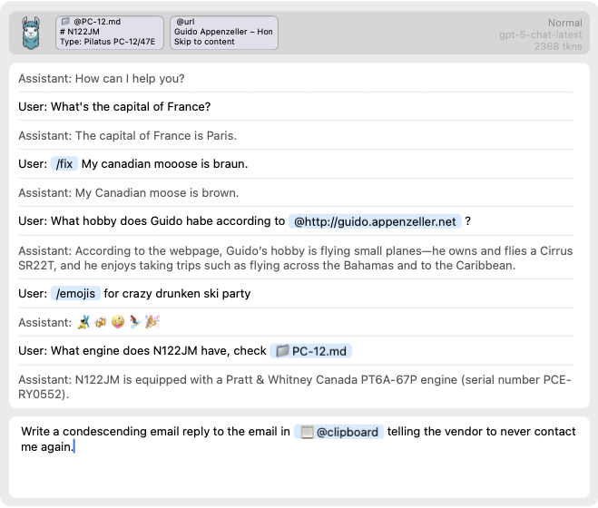

# macLLM - Fast LLM Desktop Utility for macOS

macLLM is a utility that makes it easy to work with LLMs from the macOS desktop. It is launched
via a hotkey and can do things like:
* Send a prompt to an LLM, e.g. "What state is Kansas City in?"
* Fix spelling or find emojis for a specific topic
* Work with files, e.g. "find the ship date in @~/Documents/Notes/team-meeting.md"
* Index your notes (e.g. Obsidian) and auto-complete them for easy reference
* Work with URLs, e.g. "summarize @https://github.com/appenz/macLLM/edit/main/README.md"

macLLM is:
* Open source (Apache 2.0)
* Written in 100% Python to be easily extensible
* Has a native macOS Cocoa UI (written in Python)



## Installation

macLLM uses the uv package manager, make sure you have it installed first (`https://github.com/astral-sh/uv`). 

Your OpenAI API key should be configured in the environment variable OPENAI_API_KEY.

```bash
export OPENAI_API_KEY="your_api_key"
```

Now you can run macLLM with:

```bash
uv run -m macllm
```

uv should take care of all the dependencies.

## Basic Usage

Press the hotkey. By default, it is option-space (⌥-space) but it can be easily remapped. 
A window will appear in the center of the screen and you can start typing a query to the LLM.
For example:

> Capital of france?

After a second or so you should get the answer "Paris". You can now do a few things:
1. Hit escape to close the window. Pressing the hotkey again will close it as well.
2. Press ⬆️ to move to the reply and press Command-C (⌘-C) to copy the reply.
3. Type a new query into the text box.

## Referencing external data

macLLM understands a number of external data sources:
* @clipboard is the current clipboard content
* @window is any desktop window. You can select it after entering the query with your mouse.
* @selection allows you to select any area on the screen.
* @<filename> is any file in macOS. The path has to start with "/" or "~"
* @<url> for an http url. It has to start with "http" or "https"

The data can be referenced in the query, e.g. "translate @clipboard into French" or "summarize the slide @window".

## Conversations and context

- A conversation is the running exchange between you and the assistant. macLLM keeps the full chat history in the main text area.
- When you reference external data (e.g., `@clipboard`, a path like `@~/note.md`, a URL, or an image via `@selection`/`@window`), macLLM adds that as a persistent context item for the current conversation.
- Context is automatically included with every subsequent request in the same conversation and is summarized in the top bar as small pills.
- Starting a new conversation clears prior context. You can also reset history from the UI (e.g., via the menu shortcut) if you want a clean slate.
- You can start a new conversation with Command-N (⌘-N)

## Browsing previous messages and copying

- Press Up Arrow when the caret is on the first line of the input to enter history browsing.
- Use Up/Down to move through previous user/assistant messages.
- Press Command-C (⌘-C) to copy the currently highlighted message.
- Press Return (↩) to insert the message back into the input field for quick editing/resubmission; press Escape (Esc) to exit browsing.

## Shortcuts

Shortcuts are shorthand for specific prompts and always start with the `/` symbol. For example, "/fix" is a prompt with instructions to fix spelling and grammar but but nothing else.

>/fix My Canaidian Mooose is Braun.

This gets internally expanded to:

>Fix any spelling or grammar mistakes. Make no other changes. Reply *only* with the corrected text. The input is: My Canaidian Mooose is Braun.

Which GPT will correct to:

> My Canadian Moose is Brown.

Shortcuts are read from:
1. The shortcuts.py file for built-in shortcuts
2. In TOML config files in either:
   - App config directory: ./config/
   - User config directory: ~/.config/macllm/

Config files should use TOML format with a shortcuts table. Example:
```toml
shortcuts = [
  ["/exampleshortcut", "This is the expanded version of the example shortcut."],
  ["/emoji", "Suggest a single emoji that represents the following (reply only with the emoji, do not write any other text) : "],
]
```

Entries whose trigger starts with `@` are reserved for plugin configuration tags (not user shortcuts).

## Autocomplete and highlighting

Both `/` shortcuts and `@` tags use the same autocomplete popup and inline pill highlighting:
- Typing `/` shows your configured shortcuts; typing `@` shows available tag prefixes and dynamic suggestions from plugins.
- Enter inserts the selected suggestion as a pill; Tab inserts the raw text and keeps it editable. Quoted forms like `@"..."` and `/"..."` are supported.

## Example Shortcuts
- Default examples in `config/default_shortcuts.toml`:
  - `/emoji`: Pick a relevant emoji for the text and reply only with that emoji.
  - `/emojis`: Suggest a few relevant emojis and reply only with those emojis.
- You can add more in your own TOML files under `~/.config/macllm/` (see sample above).

## Using it via the clipboard

If the clipboard contains text that starts with the trigger (default is "@@"), it will be sent to the LLM.
This can be useful if you want to use macLLM from within an editor. Just type "@@" followed by instructions (e.g. "@@shorten this paragraph:"), hit copy (⌘-C), wait a few seconds, and paste (⌘-V).

## Indexing markdown notes and file autocomplete

You can index directories of notes (e.g. Obsidian) so that files are easy to find and insert via autocomplete:

- Add `@IndexFiles` entries in any shortcuts TOML file (app or user config). On startup, macLLM will recursively index `.txt` and `.md` files in those directories.
- When you type `@` and at least 3 characters, the autocomplete will list up to 10 matching files by basename (case-insensitive substring match). Selecting a suggestion inserts a pill that shows the filename; when sent, the full path is expanded and the file’s content (up to ~10 KB) is added as context.
- Path-like tags also support direct completion for partial paths (e.g., `@~/Documents/`), including quoted paths with spaces: `@"~/My Notes/file.md"`.

Example config:

```toml
shortcuts = [
  ["@IndexFiles", "/Users/you/Notes"],
  ["@IndexFiles", "/Users/you/Work/Docs"],
]
```

## License

Apache 2.0
